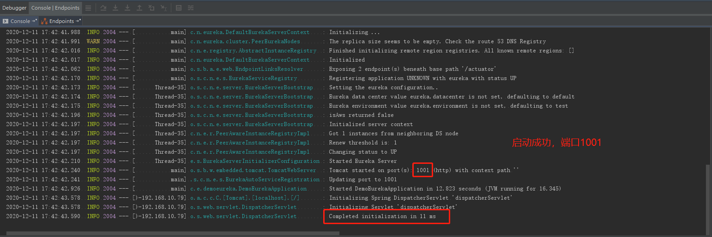
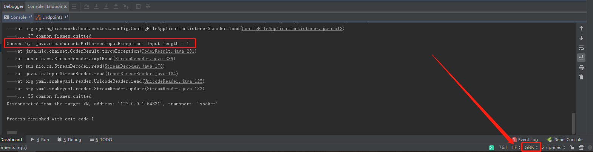

# Spring Cloud Demo

## 简介

一个立志成为种子项目的 Spring Cloud Demo。

# 从零开始搭建Spring Cloud

> **Spring Cloud 5个核心组件：**
>
> * 注册中心——Netflix Eureka
> * 配置中心——Spring Cloud Config
> * 服务网关——Spring Cloud Gateway
> * 客户端负载均衡——Netflix Ribbon（待集成）
> * 断路器——Netflix Hystrix（待集成）

## 一、 创建spring-cloud-demo

**1.创建spring-cloud-demo文件夹，新建<font color="red">pom.xml</font>文件，文件内容：**

```xml
<?xml version="1.0" encoding="UTF-8"?>

<project xmlns="http://maven.apache.org/POM/4.0.0" xmlns:xsi="http://www.w3.org/2001/XMLSchema-instance"
  xsi:schemaLocation="http://maven.apache.org/POM/4.0.0 http://maven.apache.org/xsd/maven-4.0.0.xsd">
  <modelVersion>4.0.0</modelVersion>
  <parent>
    <groupId>org.springframework.boot</groupId>
    <artifactId>spring-boot-starter-parent</artifactId>
    <version>2.2.0.RELEASE</version>
    <relativePath/> <!-- lookup parent from repository -->
  </parent>

  <groupId>com.example</groupId>
  <artifactId>spring-cloud-demo</artifactId>
  <version>1.0-SNAPSHOT</version>
  <modules>
    <module>demo-eureka</module>
    <module>demo-config</module>
    <module>demo-gateway</module>
    <module>demo-business</module>
  </modules>

  <properties>
    <java.version>1.8</java.version>
    <maven.compiler.source>1.8</maven.compiler.source>
    <maven.compiler.target>1.8</maven.compiler.target>
    <project.build.sourceEncoding>UTF-8</project.build.sourceEncoding>
    <spring-cloud.version>Hoxton.M3</spring-cloud.version>
  </properties>

  <dependencyManagement>
    <dependencies>
      <dependency>
        <groupId>org.springframework.cloud</groupId>
        <artifactId>spring-cloud-dependencies</artifactId>
        <version>${spring-cloud.version}</version>
        <type>pom</type>
        <scope>import</scope>
      </dependency>
    </dependencies>
  </dependencyManagement>

</project>
```


## 二、 集成demo-eureka

**1.在IDEA编译器中，Ctrl + Shift + Alt + S -> Modules -> + -> New Module**


**2.选择 Spring Initializr -> JDK 8 -> Default -> Next**


**等待创建。。。**


**3.修改项目名称 -> 修改JDK版本 -> Next**


**4.直接下一步**


**5.可以修改模块名称、项目路径，如果没有需要改动的，直接点击完成。**


**6.等待Maven依赖下载。**


**7.删除多余的文件和文件夹，只保留 src 文件夹和 pom.xml 文件。**


**8.修改<font color="red">pom.xml</font>文件内容如下：**

```xml
<?xml version="1.0" encoding="UTF-8"?>
<project xmlns="http://maven.apache.org/POM/4.0.0" xmlns:xsi="http://www.w3.org/2001/XMLSchema-instance"
         xsi:schemaLocation="http://maven.apache.org/POM/4.0.0 https://maven.apache.org/xsd/maven-4.0.0.xsd">
    <modelVersion>4.0.0</modelVersion>
    <parent>
        <artifactId>spring-cloud-demo</artifactId>
        <groupId>com.example</groupId>
        <version>1.0-SNAPSHOT</version>
    </parent>

    <artifactId>demo-eureka</artifactId>
    <description>Eureka project for Spring Boot</description>

    <properties>
        <java.version>1.8</java.version>
        <spring-cloud.version>Hoxton.M3</spring-cloud.version>
    </properties>

    <dependencies>
        <dependency>
            <groupId>org.springframework.cloud</groupId>
            <artifactId>spring-cloud-starter-netflix-eureka-server</artifactId>
        </dependency>
    </dependencies>

    <build>
        <plugins>
            <plugin>
                <groupId>org.springframework.boot</groupId>
                <artifactId>spring-boot-maven-plugin</artifactId>
            </plugin>
        </plugins>
    </build>

</project>
```


**9.添加@EnableEurekaServer**

<font color="red">**DemoEurekaApplication.java**</font>

```java
import org.springframework.boot.SpringApplication;
import org.springframework.boot.autoconfigure.SpringBootApplication;
import org.springframework.cloud.netflix.eureka.server.EnableEurekaServer;

/**
 * 注册中心 - Eureka
 *
 * @author ACGkaka
 */
@EnableEurekaServer
@SpringBootApplication
public class DemoEurekaApplication {

    public static void main(String[] args) {
        SpringApplication.run(DemoEurekaApplication.class, args);
    }

}
```


**10.修改 application.properties 为 <font color="red">bootstrap.yml</font>，内容如下：**

```yaml
server:
  port: 1001

eureka:
  instance:
    hostname: localhost
  client:
    # eureka.client.registerWithEureka ：表示是否将自己注册到Eureka Server，默认为true。
    # 由于当前这个应用就是Eureka Server，故而设为false
    register-with-eureka: false
    # eureka.client.fetchRegistry ：表示是否从Eureka Server获取注册信息，默认为true。因为这是一个单点的Eureka Server，
    # 不需要同步其他的Eureka Server节点的数据，故而设为false。
    fetch-registry: false
    service-url:
      # eureka.client.serviceUrl.defaultZone ：设置与Eureka Server交互的地址，
      # 查询服务和注册服务都需要依赖这个地址。默认是
      defaultZone: http://${eureka.instance.hostname}:${server.port}/eureka/
```

> **注意：**要修改编码格式为 UTF-8，不然项目启动会报错。


> **知识补充**：
>
> 为什么要使用 bootstrap.yml 而不使用 application.properties？
>
> * 文件名后缀不会影响配置文件的作用，主要在于bootstrap和application的区别；
> * bootstrap 在 application 之前生效，应用于程序启动时的上下文阶段；
> * 我们的项目中使用了Spring Cloud Config，需要在程序启动的时候让配置文件生效，从而加载到配置中心的配置文件，所以应该使用bootstrap.yml；
> * 否则，后面集成配置中心的时候会不生效。


**11.项目结构图：**


**12.测试项目是否可以启动成功**



**访问 <u>http://localhost:1001</u>**


## 三、集成demo-config

**1.步骤和第二步的内容基本一样，就不赘述了，相关的文件直接陈列在下面了。**

**项目结构图：**


<font color="red">**pom.xml**</font>

```xml
<?xml version="1.0" encoding="UTF-8"?>
<project xmlns="http://maven.apache.org/POM/4.0.0" xmlns:xsi="http://www.w3.org/2001/XMLSchema-instance"
         xsi:schemaLocation="http://maven.apache.org/POM/4.0.0 https://maven.apache.org/xsd/maven-4.0.0.xsd">
    <modelVersion>4.0.0</modelVersion>
    <parent>
        <artifactId>spring-cloud-demo</artifactId>
        <groupId>com.example</groupId>
        <version>1.0-SNAPSHOT</version>
    </parent>

    <artifactId>demo-config</artifactId>
    <description>Config project for Spring Boot</description>

    <properties>
        <java.version>1.8</java.version>
        <spring-cloud.version>Hoxton.M3</spring-cloud.version>
    </properties>

    <dependencies>

        <!-- 配置中心 -->
        <dependency>
            <groupId>org.springframework.cloud</groupId>
            <artifactId>spring-cloud-config-server</artifactId>
        </dependency>

        <!-- 注册中心 -->
        <dependency>
            <groupId>org.springframework.cloud</groupId>
            <artifactId>spring-cloud-starter-netflix-eureka-client</artifactId>
        </dependency>
    </dependencies>

    <build>
        <plugins>
            <plugin>
                <groupId>org.springframework.boot</groupId>
                <artifactId>spring-boot-maven-plugin</artifactId>
            </plugin>
        </plugins>
    </build>

</project>
```


<font color="red">**DemoConfigApplication.java**</font>

```java
import org.springframework.boot.SpringApplication;
import org.springframework.boot.autoconfigure.SpringBootApplication;
import org.springframework.cloud.config.server.EnableConfigServer;
import org.springframework.cloud.netflix.eureka.EnableEurekaClient;

/**
 * 注册中心 - Config
 *
 * @author ACGkaka
 */
@EnableConfigServer
@EnableEurekaClient
@SpringBootApplication
public class DemoConfigApplication {

    public static void main(String[] args) {
        SpringApplication.run(DemoConfigApplication.class, args);
    }

}
```


<font color="red">**bootstrap.yml**</font>

```yaml
server:
  port: 1002

spring:
  application:
    # 用于在 eureka 面板显示
    name: demo-config
  profiles:
    # 必填
    active: native
  cloud:
    config:
      server:
        native:
          search-locations: classpath:/repository

eureka:
  instance:
    hostname: localhost
  client:
    service-url:
      defaultZone: http://${eureka.instance.hostname}:1001/eureka/
```


**repository/<font color="red">demo-business-dev.yml</font>**

```yaml
server:
  port: 1006
```


**repository/<font color="red">demo-gateway-dev.yml</font>**

```yaml
server:
  port: 1003
```


## 四、集成demo-gateway

**1.步骤和第二步的内容基本一样，就不赘述了，相关的文件直接陈列在下面了。**

**项目结构图：**


<font color="red">**pom.xml**</font>

```xml
<?xml version="1.0" encoding="UTF-8"?>
<project xmlns="http://maven.apache.org/POM/4.0.0" xmlns:xsi="http://www.w3.org/2001/XMLSchema-instance"
         xsi:schemaLocation="http://maven.apache.org/POM/4.0.0 https://maven.apache.org/xsd/maven-4.0.0.xsd">
    <modelVersion>4.0.0</modelVersion>
    <parent>
        <artifactId>spring-cloud-demo</artifactId>
        <groupId>com.example</groupId>
        <version>1.0-SNAPSHOT</version>
    </parent>

    <artifactId>demo-gateway</artifactId>
    <description>Demo project for Spring Boot</description>

    <properties>
        <java.version>1.8</java.version>
        <spring-cloud.version>Hoxton.M3</spring-cloud.version>
    </properties>

    <dependencies>
        <!-- Gateway -->
        <dependency>
            <groupId>org.springframework.cloud</groupId>
            <artifactId>spring-cloud-starter-gateway</artifactId>
        </dependency>

        <!-- 配置中心 -->
        <dependency>
            <groupId>org.springframework.cloud</groupId>
            <artifactId>spring-cloud-starter-config</artifactId>
        </dependency>

        <!-- 注册中心 -->
        <dependency>
            <groupId>org.springframework.cloud</groupId>
            <artifactId>spring-cloud-starter-netflix-eureka-client</artifactId>
        </dependency>
    </dependencies>

    <build>
        <plugins>
            <plugin>
                <groupId>org.springframework.boot</groupId>
                <artifactId>spring-boot-maven-plugin</artifactId>
            </plugin>
        </plugins>
    </build>

</project>
```


<font color="red">**DemoGatewayApplication.java**</font>

```java
import org.springframework.boot.SpringApplication;
import org.springframework.boot.autoconfigure.SpringBootApplication;
import org.springframework.cloud.netflix.eureka.EnableEurekaClient;

/**
 * 服务网关 - Gateway
 *
 * @author ACGkaka
 */
@EnableEurekaClient
@SpringBootApplication
public class DemoGatewayApplication {

    public static void main(String[] args) {
        SpringApplication.run(DemoGatewayApplication.class, args);
    }

}
```


<font color="red">**bootstrap.yml**</font>

```yaml
spring:
  application:
    name: demo-gateway
  profiles:
    active: dev
  cloud:
    config:
      # 获取不到远程配置的时候立即失败，而不是没有意义地等待
      fail-fast: true
      discovery:
        enabled: true
        service-id: demo-config
      profile: ${spring.profiles.active}
      retry:
        max-attempts: 5  # 配置重试次数，默认为5
        multiplier: 1.1  # 间隔乘数，默认1.1
        initial-interval: 1000  # 初始重试间隔时间，默认1000ms
        max-interval: 2000  # 最大间隔时间，默认2000ms
    gateway:
      discovery:
        locator:
          # 使用服务发现客户端接口DiscoveryClient，从服务注册中心获取服务注册信息，然后配置相应的路由。
          enabled: true
          # 将请求路径上的服务名配置为小写
          lower-case-service-id: true
      routes:
        # id：我们自定义的路由 ID，保持唯一
        - id: demo-business-test
          # uri：目标服务地址
          uri: lb://demo-business
          # predicates：路由条件，Predicate 接受一个输入参数，返回一个布尔值结果。该接口包含多种默认方法来将 Predicate 组合成其他复杂的逻辑（比如：与，或，非）。
          predicates:
            - Path=/business/**

eureka:
  instance:
    hostname: localhost
  client:
    service-url:
      defaultZone: http://${eureka.instance.hostname}:1001/eureka/
```


## 五、写一个业务模块 demo-business

**1.步骤和第二步的内容基本一样，就不赘述了，相关的文件直接陈列在下面了。**

**项目结构图：**<font color="red">**（因为这是业务模块，所以保留test包）**</font>


<font color="red">**pom.xml**</font>

```xml
<?xml version="1.0" encoding="UTF-8"?>
<project xmlns="http://maven.apache.org/POM/4.0.0" xmlns:xsi="http://www.w3.org/2001/XMLSchema-instance"
         xsi:schemaLocation="http://maven.apache.org/POM/4.0.0 https://maven.apache.org/xsd/maven-4.0.0.xsd">
    <modelVersion>4.0.0</modelVersion>
    <parent>
        <artifactId>spring-cloud-demo</artifactId>
        <groupId>com.example</groupId>
        <version>1.0-SNAPSHOT</version>
    </parent>

    <artifactId>demo-business</artifactId>
    <description>Demo project for Spring Boot</description>

    <properties>
        <java.version>1.8</java.version>
        <spring-cloud.version>Hoxton.M3</spring-cloud.version>
    </properties>

    <dependencies>
        <!-- Mybatis -->
<!--        <dependency>-->
<!--            <groupId>org.mybatis.spring.boot</groupId>-->
<!--            <artifactId>mybatis-spring-boot-starter</artifactId>-->
<!--            <version>2.1.4</version>-->
<!--        </dependency>-->

        <!-- 配置中心 -->
        <dependency>
            <groupId>org.springframework.cloud</groupId>
            <artifactId>spring-cloud-starter-config</artifactId>
        </dependency>

        <!-- 注册中心 -->
        <dependency>
            <groupId>org.springframework.cloud</groupId>
            <artifactId>spring-cloud-starter-netflix-eureka-client</artifactId>
        </dependency>

        <!-- Lombok -->
        <dependency>
            <groupId>org.projectlombok</groupId>
            <artifactId>lombok</artifactId>
            <optional>true</optional>
        </dependency>

        <dependency>
            <groupId>org.springframework.boot</groupId>
            <artifactId>spring-boot-starter-web</artifactId>
        </dependency>

        <dependency>
            <groupId>org.springframework.boot</groupId>
            <artifactId>spring-boot-starter-test</artifactId>
            <scope>test</scope>
        </dependency>
    </dependencies>

    <build>
        <plugins>
            <plugin>
                <groupId>org.springframework.boot</groupId>
                <artifactId>spring-boot-maven-plugin</artifactId>
            </plugin>
        </plugins>
    </build>

</project>
```


<font color="red">**DemoApplication.java**</font>

```java
import org.springframework.boot.SpringApplication;
import org.springframework.boot.autoconfigure.SpringBootApplication;
import org.springframework.cloud.netflix.eureka.EnableEurekaClient;

/**
 * 业务
 *
 * @author ACGkaka
 */
@EnableEurekaClient
@SpringBootApplication
public class DemoApplication {

    public static void main(String[] args) {
        SpringApplication.run(DemoApplication.class, args);
    }

}
```


**<font color="red">WelcomeController.java</font>（这个是为了页面展示创建的）**

```java
import lombok.extern.slf4j.Slf4j;
import org.slf4j.Logger;
import org.slf4j.LoggerFactory;
import org.springframework.stereotype.Controller;
import org.springframework.web.bind.annotation.RequestMapping;
import org.springframework.web.bind.annotation.ResponseBody;

/**
 * <p> @Title WelcomeController
 * <p> @Description 首页
 *
 * @author zhj
 * @date 2020/12/11 15:52
 */
@Slf4j
@Controller
public class WelcomeController {

    private static final Logger LOGGER = LoggerFactory.getLogger(WelcomeController.class);

    @RequestMapping("/business")
    @ResponseBody
    public String welcome() {
        LOGGER.info("有一个用户访问了系统。");
        return "Hello World";
    }
}
```


<font color="red">**bootstrap.yml**</font>

```yaml
spring:
  application:
    name: demo-business
  profiles:
    active: dev
  cloud:
    config:
      # 获取不到远程配置的时候立即失败，而不是没有意义地等待
      fail-fast: true
      discovery:
        enabled: true
        service-id: demo-config
      profile: ${spring.profiles.active}
      retry:
        max-attempts: 5  # 配置重试次数，默认为5
        multiplier: 1.1  # 间隔乘数，默认1.1
        initial-interval: 1000  # 初始重试间隔时间，默认1000ms
        max-interval: 2000  # 最大间隔时间，默认2000ms

eureka:
  instance:
    hostname: localhost
  client:
    service-url:
      defaultZone: http://${eureka.instance.hostname}:1001/eureka/
```


**访问地址：**

* http://localhost:1001 - 注册中心

* http://localhost:1006 - 业务中心
* http://localhost:1003 - 测试网关是否成功转发到业务中心


## 附：报错整理

### 1. 如果创建bootstrap.yml之后启动报错：

* java.nio.charset.MalformedInputException；
* 是因为配置文件的编码格式异常，bootstrap.yml文件是否为UTF-8格式。




### 2. 读取不到Config配置

* bootstrap.yml在application.yml之前生效，应用于程序启动时的上下文阶段。搭建Spring Cloud Config 的时候应该使用bootstrap.yml。


### 3. Spring Cloud Gateway路由配置方式

* 基础URI一种路由配置方式；
* 如果请求的目标地址，是单个的URI资源路径，配置文件示例如下：

```yaml
server:
  port: 8080
spring:
  application:
    name: api-gateway
  cloud:
    gateway:
      routes:
        -id: url-proxy-1
          uri: https://blog.csdn.net
          predicates:
            -Path=/csdn
```

* 各字段含义如下：
  * id：我们自定义的路由 ID，保持唯一
  * uri：目标服务地址
  * predicates：路由条件，Predicate 接受一个输入参数，返回一个布尔值结果。该接口包含多种默认方法来将 Predicate 组合成其他复杂的逻辑（比如：与，或，非）。
* 上面这段配置的意思是，配置了一个 id 为 url-proxy-1的URI代理规则，路由的规则为：当访问地址http://localhost:8080/csdn/1.jsp时，会路由到上游地址https://blog.csdn.net/1.jsp。


显示如上内容是正常的。


### 4. 业务中心启动闪退

* 增加如下依赖即可：

```xml
<dependency>
    <groupId>org.springframework.boot</groupId>
    <artifactId>spring-boot-starter-web</artifactId>
</dependency>
```